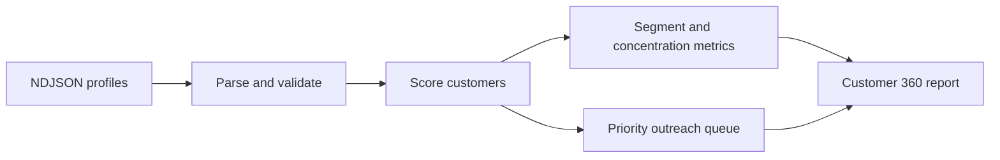

# Customer 360 Pipeline

Python customer platform pipeline that turns raw profile rows into a flagship 360 report with segmentation, concentration analysis, health scoring, and outreach prioritization.

## Why This Exists

This repo is meant to read like a serious customer data platform artifact, not a notebook export. The point is to show that messy profile data can be normalized, scored, and packaged into decisions that sales, success, and analytics teams can actually use.

## What This Demonstrates

- identity stitching and profile-level normalization
- value bands, churn-risk scoring, and retention posture
- segment concentration analysis and customer revenue share
- deterministic JSON outputs that work as a reporting contract
- explainable heuristics instead of opaque model scores

## Architecture



## Run It

```bash
python -m unittest discover -s tests
python -m src.analyzer --input data/profiles.ndjson --output out/report.json
python scripts/benchmark.py
```

## Tradeoffs

1. The scoring logic is deliberately transparent so recruiters can inspect the reasoning quickly.
2. A single report object keeps the contract stable for downstream consumers.
3. The project favors deterministic heuristics over probabilistic models because the goal is explainability and portability.

## Operational Framing

- `priority_customers` is the queue customer success would inspect first.
- `concentration.top_two_customer_share` highlights revenue dependency risk.
- `segment_profiles` helps compare expansion posture across customer groups.

## Verification

Run `python -m unittest discover -s tests` for regression coverage and `python scripts/benchmark.py` for a quick throughput check.

## Further Reading

- [Architecture](./docs/ARCHITECTURE.md)
- [Operations](./docs/OPERATIONS.md)
